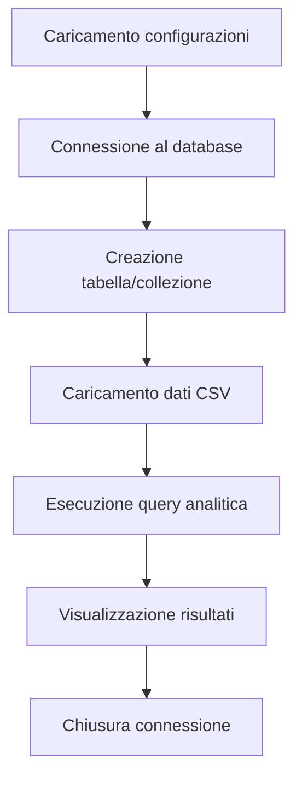

# 🚀 Progetto Database CSV Loader

<div align="center">


</div>

<p align="center">
  
  
  
  
</p>

## 📋 Panoramica

Questo progetto contiene una suite di script Python per l'elaborazione di dati CSV e l'esecuzione di analisi su diversi database. Ogni script è progettato per lavorare con un database specifico, dimostrando l'integrazione e le caratteristiche principali di ciascun database.

> **Nota**: Questi script sono progettati per adattarsi dinamicamente a qualsiasi struttura CSV, rendendo il codice molto flessibile.

## ✨ Caratteristiche

- 🔄 **Caricamento dinamico** dei dati da file CSV
- 🛠️ **Creazione automatica** di tabelle/collezioni basate sulla struttura del CSV
- 🔍 **Query analitiche** per ogni tipo di database
- 📊 **Reporting** dei risultati e delle prestazioni
- 🧩 **Configurazioni esterne** via file `.env`
- 📝 **Logging** dettagliato di ogni operazione

## 🛠️ Database Supportati

| Database | Script | Funzionalità |
|----------|--------|--------------|
| **PostgreSQL** | `postgresql_script.py` | Conta quante email terminano con ".com" |
| **MongoDB** | `mongodb_script.py` | Conta quante "Subscription Date" sono dell'anno 2020 |
| **SQLite** | `sqlite_script.py` | Conta quanti URL iniziano con "https://" |
| **DuckDB** | `duckdb_script.py` | Conta quanti URL hanno dominio di primo livello ".info" |

## 📦 Prerequisiti

Prima di eseguire gli script, assicurati di avere:

* Python 3.7 o superiore
* I database corrispondenti installati (PostgreSQL, MongoDB, SQLite, DuckDB)
* Pip per l'installazione delle dipendenze

```bash
# Installazione delle dipendenze
pip install -r requirements.txt
```

## ⚙️ Configurazione

Il progetto utilizza un file `.env` per configurare le connessioni ai database e i percorsi dei file CSV:

```ini
# PostgreSQL
PG_DBNAME=postgres
PG_USER=postgres
PG_PASSWORD=postgres
PG_HOST=localhost
PG_PORT=5432

# MongoDB
MONGO_URI=mongodb://localhost:27017/
MONGO_DB_NAME=esame_db
MONGO_COLLECTION=utenti

# SQLite
SQLITE_DB_FILE=utenti.db

# DuckDB
DUCKDB_DB_FILE=utenti.duckdb

# Percorsi CSV
CSV_FILE_5000=esercizi/input_5000.csv
CSV_FILE_8000=esercizi/input_8000.csv
CSV_FILE_10000=esercizi/input_10000.csv
CSV_FILE_2000=esercizi/input_2000.csv
```

> 💡 Se mancano alcune variabili o il file `.env` non esiste, gli script utilizzeranno valori predefiniti.

## 🚀 Esecuzione

Ogni script può essere eseguito indipendentemente con un semplice comando:

```bash
# Esecuzione dello script PostgreSQL
python postgresql_script.py

# Esecuzione dello script MongoDB 
python mongodb_script.py

# Esecuzione dello script SQLite
python sqlite_script.py

# Esecuzione dello script DuckDB
python duckdb_script.py
```

## 📊 Esempio di Output

```
RISULTATI:
Totale righe caricate: 10000
Website che iniziano con 'https://': 4898

Tempo totale di esecuzione: 0.04 secondi.
```

## 🧩 Struttura del Flusso di Esecuzione

Ogni script segue un flusso di lavoro simile:



## 🔍 Funzionalità Dettagliate

### Caratteristiche Comuni
- **Gestione dinamica delle strutture CSV**: Adattamento automatico a qualsiasi formato CSV
- **Gestione errori robusta**: Logging dettagliato e gestione delle eccezioni
- **Ottimizzazione delle prestazioni**: Transazioni batch e tecniche specifiche per database
- **Rilevamento intelligente delle colonne**: Identificazione automatica delle colonne rilevanti per le query

### Caratteristiche Specifiche per Database
- **PostgreSQL**: Query SQL avanzate e gestione parametrizzata
- **MongoDB**: Gestione di documenti schema-less e conversione intelligente delle date
- **SQLite**: Gestione delle parole riservate e ottimizzazione delle transazioni
- **DuckDB**: Caricamento ottimizzato tramite viste e query analitiche performanti

## 📝 Note e Best Practices

- Assicurarsi che i database siano avviati prima di eseguire gli script
- I file CSV devono avere un'intestazione nella prima riga
- Gli script sono ottimizzati per grandi volumi di dati
- Ogni script genera log dettagliati per il debug
- Le prestazioni possono variare in base alla configurazione hardware

## 🤝 Contributi

Contributi e suggerimenti sono sempre benvenuti! Sentiti libero di:
- Forkare il repository
- Creare un branch (`git checkout -b feature/miglioramento`)
- Committare i tuoi cambiamenti (`git commit -am 'Aggiunta funzionalità XYZ'`)
- Pushare al branch (`git push origin feature/miglioramento`)
- Aprire una Pull Request

## 📜 Licenza

Questo progetto è distribuito con licenza MIT. Consulta il file `LICENSE` per maggiori dettagli. 